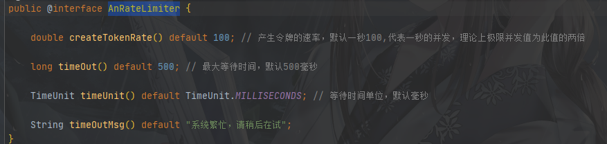
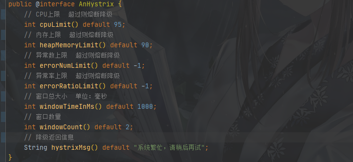
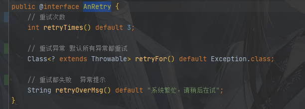

# utils-springboot-starter

## 介绍

一个关于Mybatis和spring的公共组件starter，目前包含以下功能：

- 接口请求日志
- SQL执行日志
- 数据自动加解密
- 数据自动脱敏
- 服务治理方面：
    - 接口限流
    - 接口熔断降级：CPU、内存、异常数、异常率指标
    - 方法调用重试

## 使用说明  

- **接口请求日志**

  请求日志需在接口层面打上@RequestLog注解  

- **SQL执行日志**

  需要在配置文件中配置开启日志打印

  

- **数据自动加解密**
  1. 在Mapper中加上@EncryptAndDecry注解，并选择加解密方式以及加解密字段(实体类中的)
  2. 如下(查询自动解密，更新或插入自动加密)：

     
  3. 说明：MD5只能加密，AES、RAS加解密还需要在配置文件中配置KEY：

```Java
my-utils:
  config:
    # RES 方式需要配置16位加解密key
    aes-key: 1234567891123456
    # RSA 需要配置公钥和私钥
    rsa-private-key: xxx
    rsa-public-key: xx
```

  **注意：** 加密后为字符串，注意格式！

- **数据自动脱敏**
  1. 在接口层面打上@DataDesensitization注解
  2. 在接口需要返回的实体类中对需要脱敏的字段打上@DataDesensitizationMode注解即可
  3. @DataDesensitizationMode使用说明：
  4. 内置了几种常见的脱敏类型，如姓名、地址、手机号、邮箱、身份证等
  5. 支持自定义，两种方式（同时配置，正则优先）：
      - 字符替换为"*"：自己配置需要替换的字符串区间 [startInclude,endExclude]  
      - 正则替换：自己配置正则表达式（regex）,替换匹配的内容为（replacedChar ，默认"*"）
  6.   脱敏类型，见DesensitizationTypeEnum枚举类，自定义时配置为其他

- **服务治理**
  1. 接口限流：接口打上@AnRateLimiter注解：

      
  2. 熔断降级：接口打上@AnHystrix注解（支持4个指标CPU、内存、异常数、异常率）

      
  3. 方法重试机制：方法上打上@AnRetry注解（重试需注意事务等问题）

     


    


